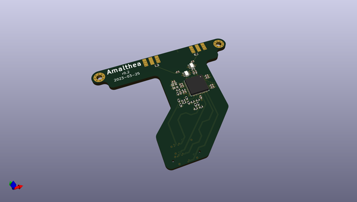
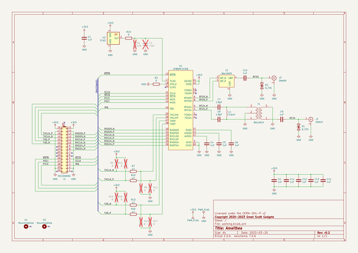

# OOMP Project  
## amalthea-hardware  by greatscottgadgets  
  
(snippet of original readme)  
  
- amalthea-hardware  
  
Amalthea is an experimental experimental SDR platform implemented as a mezzanine add-on for [Cynthion](https://greatscottgadgets.com/cynthion/).  
  
Gateware and host software may be found in the [amalthea repository](https://github.com/greatscottgadgets/amalthea).  
  
  full source readme at [readme_src.md](readme_src.md)  
  
source repo at: [https://github.com/greatscottgadgets/amalthea-hardware](https://github.com/greatscottgadgets/amalthea-hardware)  
## Board  
  
  
## Schematic  
  
  
  
[schematic pdf](working_schematic.pdf)  
## Images  
