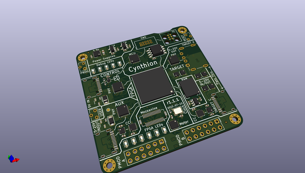
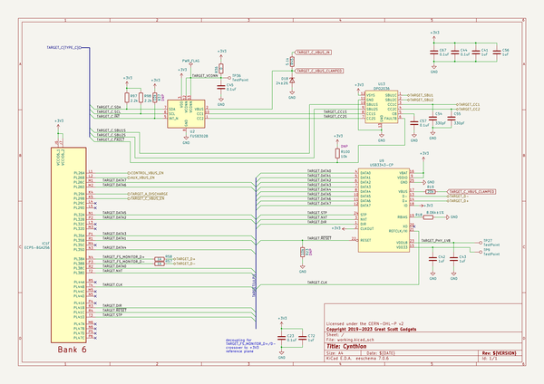

# OOMP Project  
## cynthion-hardware  by greatscottgadgets  
  
oomp key: oomp_projects_flat_greatscottgadgets_cynthion_hardware  
(snippet of original readme)  
  
- Cynthion: hardware design for a USB test instrument  
  
Cynthion is an open source hardware tool for building, testing, monitoring, and experimenting with USB devices. It is the primary platform for the [LUNA](https://github.com/greatscottgadgets/luna) USB gateware library based on [Amaranth HDL](https://github.com/amaranth-lang/amaranth).  
  
Cynthion is designed in [KiCad](https://www.kicad.org/), an open source electronic design automation package.  
  
-- Related Projects  
  
* [Cynthion](https://github.com/greatscottgadgets/cynthion): software for Cynthion  
* [LUNA](https://github.com/greatscottgadgets/luna): USB gateware library  
* [Apollo](https://github.com/greatscottgadgets/apollo): the firmware that runs on Cynthion's debug controller and which is responsible for configuring its FPGA  
* [Saturn-V](https://github.com/greatscottgadgets/saturn-v): a DFU bootloader created for Cynthion  
* [Packetry](https://github.com/greatscottgadgets/packetry): software for USB analysis  
* [Facedancer](https://github.com/greatscottgadgets/facedancer): software to create USB devices in Python  
  
  full source readme at [readme_src.md](readme_src.md)  
  
source repo at: [https://github.com/greatscottgadgets/cynthion-hardware](https://github.com/greatscottgadgets/cynthion-hardware)  
## Board  
  
  
## Schematic  
  
  
  
[schematic pdf](working_schematic.pdf)  
## Images  
