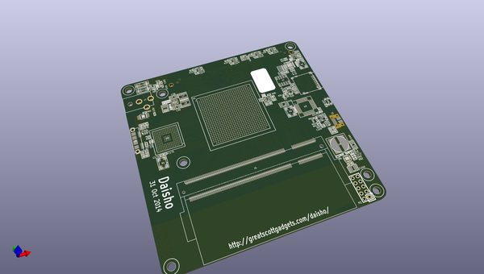
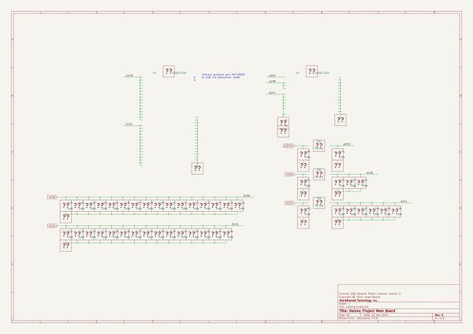

# OOMP Project  
## daisho  by greatscottgadgets  
  
oomp key: oomp_projects_flat_greatscottgadgets_daisho  
(snippet of original readme)  
  
Daisho  
======  
  
Daisho is a SuperSpeed USB 3.0 FPGA platform.  The Daisho Platform is intended  
for operation as a pair of components:  
  
A mainboard with an FPGA can connect to a back-end computer via SuperSpeed USB.  
  
A front-end board for a particular application connects to the mainboard via a  
high speed parallel connector.  
  
Front-end boards are planned that enable in-line monitoring and injection for  
high speed wired communication media.  
  
  full source readme at [readme_src.md](readme_src.md)  
  
source repo at: [https://github.com/greatscottgadgets/daisho](https://github.com/greatscottgadgets/daisho)  
## Board  
  
  
## Schematic  
  
  
  
[schematic pdf](working_schematic.pdf)  
## Images  
