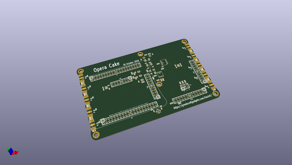
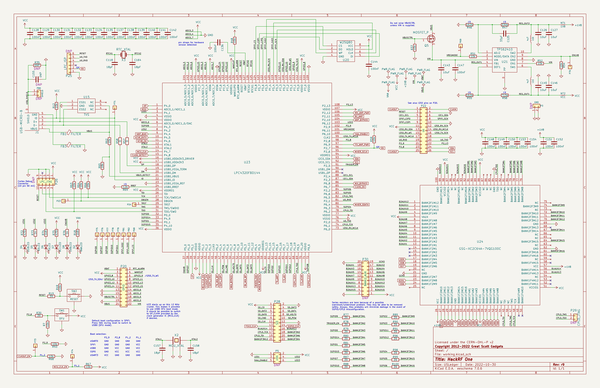

# OOMP Project  
## hackrf  by greatscottgadgets  
  
oomp key: oomp_projects_flat_greatscottgadgets_hackrf  
(snippet of original readme)  
  
- HackRF  
  
This repository contains hardware designs and software for HackRF,  
a low cost, open source Software Defined Radio platform.  
  
  
  
(photo by fd0 from https://github.com/fd0/hackrf-one-pictures)  
  
principal author: Michael Ossmann <mike@ossmann.com>  
  
Information on HackRF and purchasing HackRF: https://greatscottgadgets.com/hackrf/  
  
--------------------  
  
- Documentation  
  
Documentation for HackRF can be viewed on [Read the Docs](https://hackrf.readthedocs.io/en/latest/). The raw documentation files for HackRF are in the [docs folder](https://github.com/mossmann/hackrf/tree/master/docs) in this repository and can be built locally by installing [Sphinx Docs](https://www.sphinx-doc.org/en/master/usage/installation.html) and running `make html`. Documentation changes can be submitted through pull request and suggestions can be made as GitHub issues.   
  
To create a PDF of the HackRF documentation from the HackRF repository while on Ubuntu:  
* run `sudo apt install latexmk texlive-latex-extra`  
* navigate to hackrf/docs on command line  
* run the command `make latex`  
* run the command `make latexpdf`  
  
--------------------  
  
- Getting Help  
  
Before asking for help with HackRF, check to see if your question is listed in the [FAQ](https://hackrf.readthedocs.io/en/latest/faq.html).  
  
For assistance with HackRF general use or development, please look at the [issues on the GitHub project](https:/  
  full source readme at [readme_src.md](readme_src.md)  
  
source repo at: [https://github.com/greatscottgadgets/hackrf](https://github.com/greatscottgadgets/hackrf)  
## Board  
  
  
## Schematic  
  
  
  
[schematic pdf](working_schematic.pdf)  
## Images  
