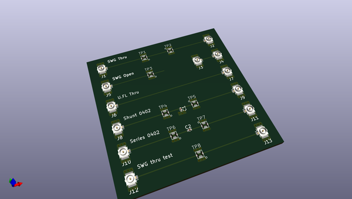
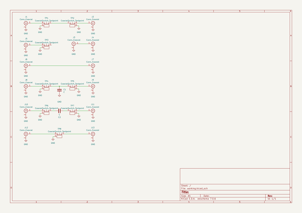

# OOMP Project  
## lab-notes  by greatscottgadgets  
  
oomp key: oomp_projects_flat_greatscottgadgets_lab_notes  
(snippet of original readme)  
  
- lab-notes  
notes, test reports, and other documentation for projects in progress  
  
  full source readme at [readme_src.md](readme_src.md)  
  
source repo at: [https://github.com/greatscottgadgets/lab-notes](https://github.com/greatscottgadgets/lab-notes)  
## Board  
  
  
## Schematic  
  
  
  
[schematic pdf](working_schematic.pdf)  
## Images  
