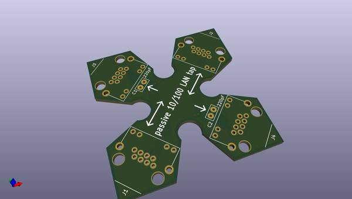
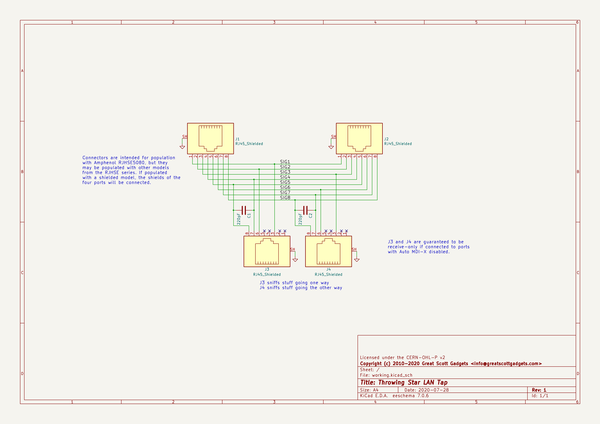

# OOMP Project  
## throwing-star-lan-tap  by greatscottgadgets  
  
oomp key: oomp_projects_flat_greatscottgadgets_throwing_star_lan_tap  
(snippet of original readme)  
  
- Throwing Star LAN TAP  
  
A passive tap for monitoring 10/100 Ethernet.  
  
-- parts required:  
 * qty 4 RJ45 connectors: Amphenol RJHSE-5080 (unshielded) or RJHSE-5380 (shielded)  
 * qty 2 220pF through-hole capacitors with .1" lead spacing (e.g. KEMET C315C221K1G5TA)  
  
These design files are licensed under the terms in the file, LICENSE.  
  
For more information: https://greatscottgadgets.com/throwingstar/  
  
  full source readme at [readme_src.md](readme_src.md)  
  
source repo at: [https://github.com/greatscottgadgets/throwing-star-lan-tap](https://github.com/greatscottgadgets/throwing-star-lan-tap)  
## Board  
  
  
## Schematic  
  
  
  
[schematic pdf](working_schematic.pdf)  
## Images  
