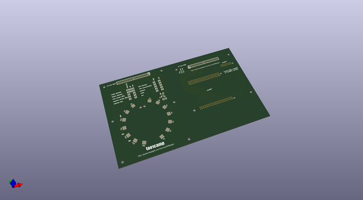
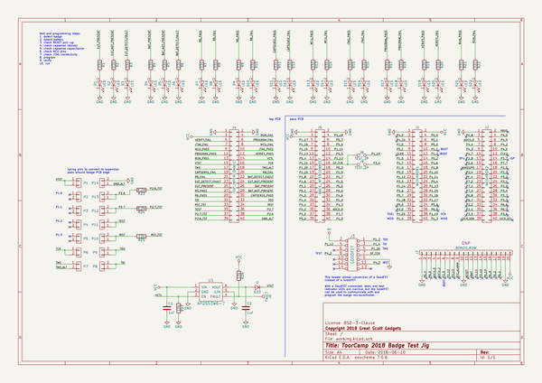

# OOMP Project  
## toorcamp2018badge  by greatscottgadgets  
  
oomp key: oomp_projects_flat_greatscottgadgets_toorcamp2018badge  
(snippet of original readme)  
  
- Toorcamp 2018 Badge  
This repository contains hardware designs and software for the ToorCamp 2018 badge, which is an electronic jar of fireflies.   
  
  
  
--------------------  
  
- Documentation  
  
Documentation for the ToorCamp 2018 Badge can be viewed on the Great Scott Gadgets [web page for this project](https://greatscottgadgets.com/toorcamp2018badge/).  
  
--------------------  
  
- Getting Help  
  
We invite you to join our community discussions on [Discord](https://discord.gg/rsfMw3rsU8). Note that while technical support requests are welcome here, we do not have support staff on duty at all times.   
  full source readme at [readme_src.md](readme_src.md)  
  
source repo at: [https://github.com/greatscottgadgets/toorcamp2018badge](https://github.com/greatscottgadgets/toorcamp2018badge)  
## Board  
  
  
## Schematic  
  
  
  
[schematic pdf](working_schematic.pdf)  
## Images  
