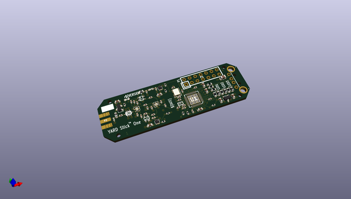
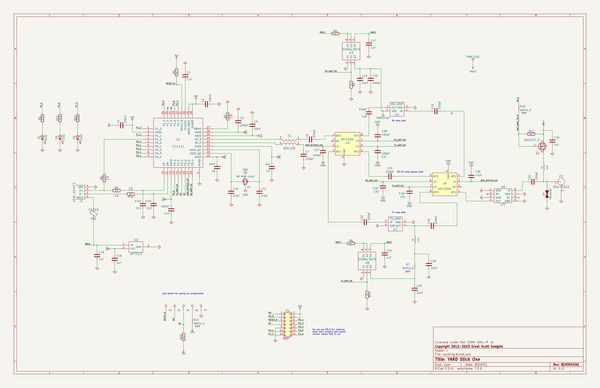

# OOMP Project  
## yardstick  by greatscottgadgets  
  
(snippet of original readme)  
  
- YARD Stick One  
  
This repository contains hardware designs and software for YARD Stick One, a sub-1 GHz wireless transceiver controlled by your computer.  
  
Information on purchasing YARD Stick One: [https://greatscottgadgets.com/yardstickone/](https://greatscottgadgets.com/yardstickone/)  
  
-------------------  
  
- Documentation  
  
Documentation for YARD Stick One can be viewed on [Read the Docs](https://yardstickone.readthedocs.io/en/latest/). The raw documenation files for YARD Stick One are in the [docs folder](https://github.com/greatscottgadgets/yardstick/tree/master/docs) in this repository and can be built locally by installing [Sphinx Docs](https://www.sphinx-doc.org/en/master/usage/installation.html) and running `make html`. Documentation changes can be submitted through pull request and suggestions can be made as GitHub issues.   
  
--------------------  
  
- Getting Help  
  
Before asking for help with YARD Stick One, check to see if your question is listed in the [FAQ](https://yardstickone.readthedocs.io/en/latest/faq.html).  
  
For assistance with YARD Stick One general use or development, please look at the [issues on the GitHub project](https://github.com/greatscottgadgets/yardstick). This is the preferred place to ask questions so that others may locate the answer to your question in the future.  
  
We invite you to join our community discussions on [Discord](https://discord.gg/rsfMw3rsU8). Note that while technical support requests are welcome here, we do not have support staff o  
  full source readme at [readme_src.md](readme_src.md)  
  
source repo at: [https://github.com/greatscottgadgets/yardstick](https://github.com/greatscottgadgets/yardstick)  
## Board  
  
  
## Schematic  
  
  
  
[schematic pdf](working_schematic.pdf)  
## Images  
