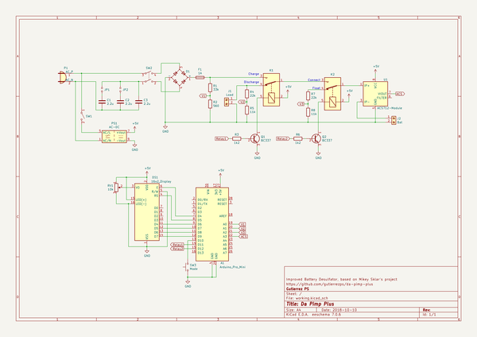

# OOMP Project  
## da-pimp-plus  by gutierrezps  
  
(snippet of original readme)  
  
- DA PIMP Plus  
  
Improved Battery Desulfator, based on [Mikey Sklar's project](http://mikeysklar.blogspot.com/p/da-pimp-battery-desulfator.html). This repository has both the schematic and the Arduino firmware, developed and built with [PlatformIO](https://platformio.org/).  
  
My blog post: <https://gutierrezps.wordpress.com/2018/10/18/da-pimp-plus/>  
  
-- Improvements  
  
* Arduino Pro Mini MCU  
* Graphical 16x2 LCD  
* Charge, discharge and float modes  
* Voltage and current sensing  
* Time display (how long has it been on selected mode)  
  
-- Bill of materials  
  
* [TXT](kicad-project/da-pimp-plus/bill-of-materials.txt)  
* [CSV](kicad-project/da-pimp-plus/bill-of-materials.csv)  
  
-- Schematic  
  
[da-pimp-plus-sch.pdf](da-pimp-plus-sch.pdf)  
  
* JP1 and JP2 are used to select the max charging current (82 mA if both disconnected, 164 mA if either is connected, 246 mA if both connected)  
* V1, V2 and V3 are the voltage measurements for each mode (charge, discharge and float)  
* R1 and R2 are 2W resistors  
* J1 is used to connect a load to be used on the discharge mode (like a car incandescent light bulb)  
* SW3 is used to select the operating mode by switching relays K1 and K2  
* Current is measured through an ACS712-5A module  
* Graphical information is shown on DS1, a 16x2 Alphanumeric Display  
* **DANGER**: **DO NOT HANDLE THE BATTERY LEADS WHEN SW2 IS ON**  
  
-- Programming  
  
When programming your Arduino, you must adjust `k_modeFactor` values on `src/main.cpp` by feeding an known voltage on the battery   
  full source readme at [readme_src.md](readme_src.md)  
  
source repo at: [https://github.com/gutierrezps/da-pimp-plus](https://github.com/gutierrezps/da-pimp-plus)  
## Board  
  
  
## Schematic  
  
  
  
[schematic pdf](working_schematic.pdf)  
## Images  
