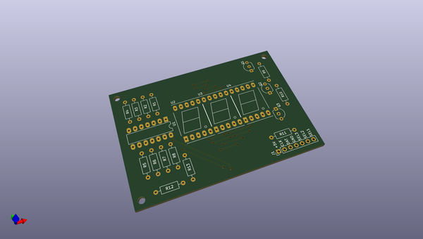
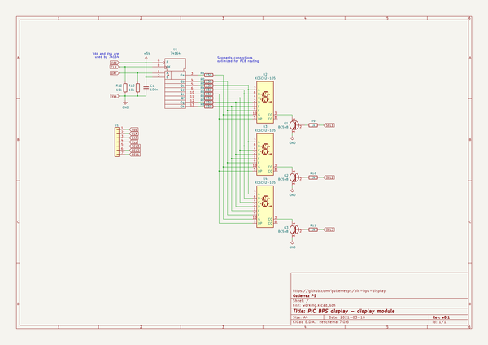

# OOMP Project  
## pic-bps-display  by gutierrezps  
  
oomp key: oomp_projects_flat_gutierrezps_pic_bps_display  
(snippet of original readme)  
  
- PIC Bench Power Supply display  
  
This is a volt/ammeter display for bench power supplies, based on PIC18F2550.  
It is originally designed as a replacement for old power supplies whose displays  
are damaged.  
  
Firmware is developed using MPLAB XC8 Compiler (through MPLAB X IDE), based  
on some of [my own libraries].  
  
Schematics and PCB are designed using [KiCAD]. Some components were taken from  
my KiCAD libraries: [gtrzps-kicad-symbols] and [gtrz.pretty].  
  
[my own libraries]: https://github.com/gutierrezps/PIC18F2550_Libraries  
[KiCAD]: https://kicad.org/  
[gtrzps-kicad-symbols]: https://github.com/gutierrezps/gtrzps-kicad-symbols  
[gtrz.pretty]: https://github.com/gutierrezps/gtrzps.pretty  
  
  full source readme at [readme_src.md](readme_src.md)  
  
source repo at: [https://github.com/gutierrezps/pic-bps-display](https://github.com/gutierrezps/pic-bps-display)  
## Board  
  
  
## Schematic  
  
  
  
[schematic pdf](working_schematic.pdf)  
## Images  
