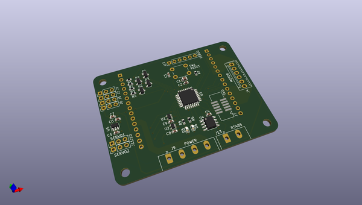
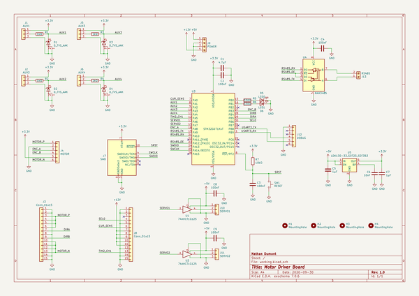

# OOMP Project  
## piwars-motor-driver-hardware  by hairymnstr  
  
oomp key: oomp_projects_flat_hairymnstr_piwars_motor_driver_hardware  
(snippet of original readme)  
  
- Motor and Servo Driver Board  
  
  
  
This small board was designed for our robot in PiWars 2021.  
It's designed to drive a small DC motor up to ~4A/12V with optional quadrature encoder feedback and up to two servo motors.  
The board interfaces with a host system via RS485 and its address is set with three jumpers on the board, so you can have up to 8 of these on a single 485 bus.  
In the competition we used 6 of these, four for our all-wheel steering robot and two for a grab arm.  In total we used 6 servos and 6 DC motors.  All were controlled via a RaspberryPi with negligible lag.  
  
The actual H-bridge in this module is an ST VNH7070AS mounted on an eval board. <https://uk.farnell.com/stmicroelectronics/ev-vnh7070as/eval-board-high-bridge-motor-driver>  I chose the eval board option because the part had a thermal slug underneath it and I didn't have a way to surface mount it at home.  
  
-- Issues  
  
There are a couple of issues with the current board:  
  
1. The servo connector pinout is wrong for all standard servos.  When I designed the board I didn't think to check and placed the signal in the middle pin between the power and ground.  RC servos are normally Gnd-Pwr-Sig.  You can work around this by carefully removing the signal and power wires from the connector shell and re-inserting them in the special order required.  
  
2. There should be a bulk capacitor on the 5V rail.  Our robot had a big (3A) 5V regulator which powered all the contr  
  full source readme at [readme_src.md](readme_src.md)  
  
source repo at: [https://github.com/hairymnstr/piwars-motor-driver-hardware](https://github.com/hairymnstr/piwars-motor-driver-hardware)  
## Board  
  
  
## Schematic  
  
  
  
[schematic pdf](working_schematic.pdf)  
## Images  
