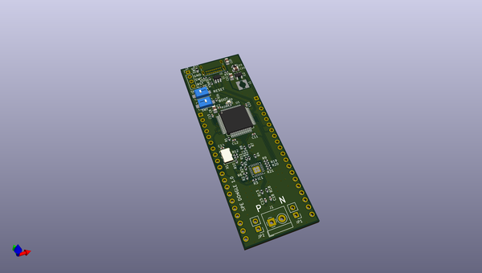
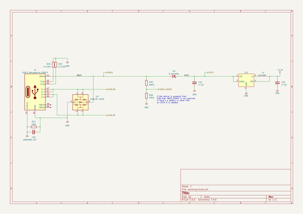

# OOMP Project  
## spe_dongle  by hairymnstr  
  
(snippet of original readme)  
  
- USB to Single Pair Ethernet Dongle  
  
  
  
This project is a development board for experimenting with Single Pair Ethernet.  
Specifically it has a 10Base-T1S PHY which means it can do short range 10Mbps  
comms over a single twisted pair and it is capable of working in a multi-drop  
bus without a networks switch.  The board has USB2.0 device only implementation  
of the USB-C connector.  The first goal is to make a USB to SPE bridge so that  
a Linux host can connect to an SPE network for testing with wireshark etc.  
  
The board also has a number of GPIO broken out to aid in making up devices for  
the bus or testing latencies by measuring GPIO toggling etc.  
  
-- Design decisions  
  
1. **Why's it using such a low spec processor?**  
It's the best I could find in stock.  Chip shortages.  I'd prefer to use  
the STM32F407 perhaps, although the smallest pinout for that part is 100 pins  
where I only need 64.  
  
2. **Why don't you just buy the USB eval board from Microchip?**  
You're right, there is a ready made USB eval board for the LAN867x, but it's  
more expensive than this board even making small quantities AND I can't buy it  
at the moment.  
  
3. **Will it be the perfect solution then?**  
No.  It's going to be okay for testing but the performance is probably going  
to be poor.  Apart from anything else it's only Full Speed USB (12Mbps) which  
has a 1kHz polling loop meaning you can get 1ms latency o  
  full source readme at [readme_src.md](readme_src.md)  
  
source repo at: [https://github.com/hairymnstr/spe_dongle](https://github.com/hairymnstr/spe_dongle)  
## Board  
  
  
## Schematic  
  
  
  
[schematic pdf](working_schematic.pdf)  
## Images  
