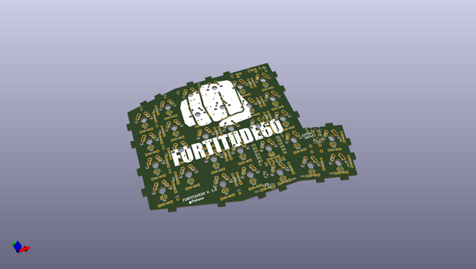
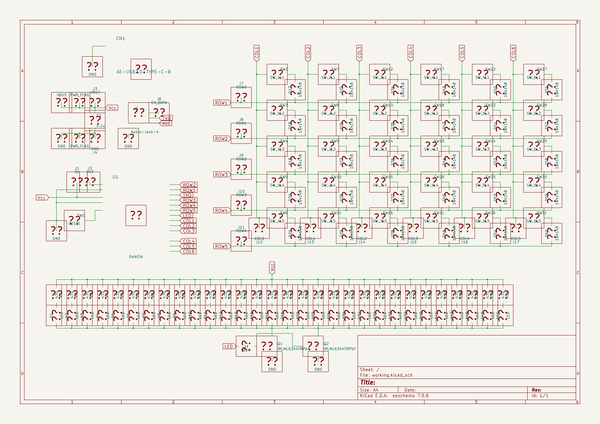

# OOMP Project  
## fortitude60  by haru-ake  
  
(snippet of original readme)  
  
- Fortitude60  
  
  
  
👊A 60% (12x5) split keyboard with staggerd column layout.👊  
  
- Build Guide  
  
-- Fortitude60 v1.0(C94 Limited Edition)  
[ビルドガイド（日本語）](Documents/buildguide_jp_v1.0.md)  
  
- License  
  
Released under the MIT license. see [LICENSE](https://github.com/Pekaso/fortitude60/blob/master/LICENSE)  
  full source readme at [readme_src.md](readme_src.md)  
  
source repo at: [https://github.com/haru-ake/fortitude60](https://github.com/haru-ake/fortitude60)  
## Board  
  
  
## Schematic  
  
  
  
[schematic pdf](working_schematic.pdf)  
## Images  
