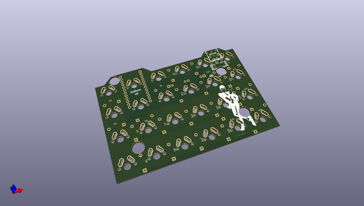
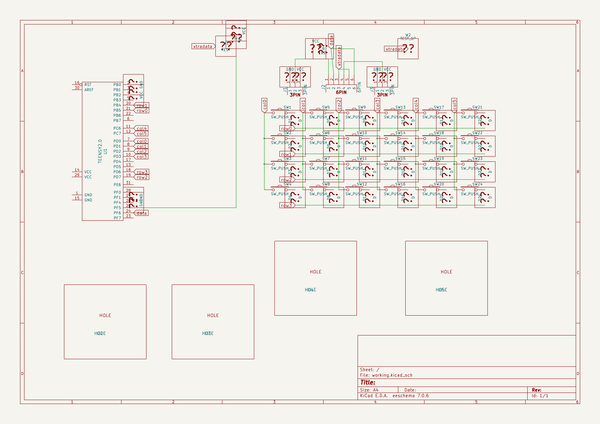

# OOMP Project  
## let-s-Split-v2  by haru-ake  
  
oomp key: oomp_projects_flat_haru_ake_let_s_split_v2  
(snippet of original readme)  
  
  
  full source readme at [readme_src.md](readme_src.md)  
  
source repo at: [https://github.com/haru-ake/let-s-Split-v2](https://github.com/haru-ake/let-s-Split-v2)  
## Board  
  
  
## Schematic  
  
  
  
[schematic pdf](working_schematic.pdf)  
## Images  
