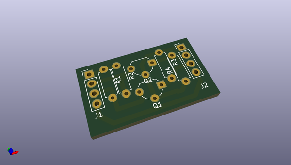
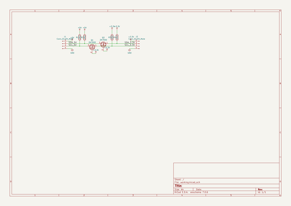

# OOMP Project  
## i2c-logic-level-converter  by hormigaAzul  
  
oomp key: oomp_projects_flat_hormigaazul_i2c_logic_level_converter  
(snippet of original readme)  
  
i2c-logic-level-converter  
=========================  
  
I2C logic level converter after NXP Application Note AN10441, prototyped on stripboard.  
  
Schematic and layout created using an online editor (http://www.3lectronics.com/stripboard-schematic-layout-editor/stripboard-layout-and-schematic-free-editor.svg). The Project file saved from the editor is Hardware/i2c-converter-stripboard-layout.txt. There is also a Kicad schematic, Hardware/i2c-logic-level-converter.sch.  
  
Blog post published http://smokedprojects.blogspot.com/2013/08/stripboard-i2c-logic-level-converter.html  
  
  full source readme at [readme_src.md](readme_src.md)  
  
source repo at: [https://github.com/hormigaAzul/i2c-logic-level-converter](https://github.com/hormigaAzul/i2c-logic-level-converter)  
## Board  
  
  
## Schematic  
  
  
  
[schematic pdf](working_schematic.pdf)  
## Images  
