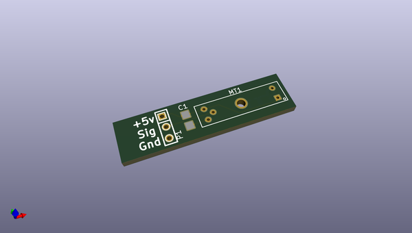
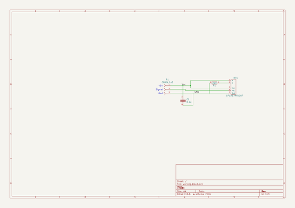

# OOMP Project  
## Crazyflie_Tools  by imciner2  
  
(snippet of original readme)  
  
- Crazyflie_Tools  
Miscellaneous tools and projects used to measure parameters about the Crazyflie Nano-Quadcopter.  
  
  full source readme at [readme_src.md](readme_src.md)  
  
source repo at: [https://github.com/imciner2/Crazyflie_Tools](https://github.com/imciner2/Crazyflie_Tools)  
## Board  
  
  
## Schematic  
  
  
  
[schematic pdf](working_schematic.pdf)  
## Images  
