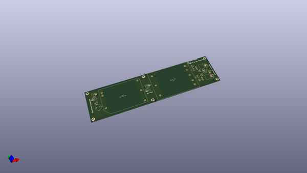
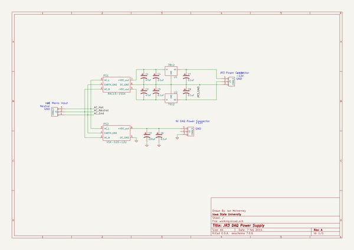

# OOMP Project  
## JR3_DAQ  by imciner2  
  
oomp key: oomp_projects_flat_imciner2_jr3_daq  
(snippet of original readme)  
  
JR3_DAQ  
=======  
  
Analog Data Acquisition unit for a JR3 Force/Moment sensor.  
  
-- Requirements:  
* All connections must be idiot-proof  
* Sealed box, only JR3 connector, computer connector, power connector  
*	Raw voltage must be recorded  
  
  
-- Sensor:  
It must interface with a JR3	67M25A3-I40-AH 200N. That sensor has the following features:  
*	Requires a +-12V supply  
*	Provides a +-10V output  
	  
  
-- Digital Acquisition Hardware  
It uses a NI USB-6221 DAQ in the OEM form-factor. That sensor has the following features:  
*	16 analog inputs  
*	250kS/s  
*	Labview interface  
*	http://sine.ni.com/nips/cds/view/p/lang/en/nid/209809  
*	34-pin ribbon cable connector  
  
  
  full source readme at [readme_src.md](readme_src.md)  
  
source repo at: [https://github.com/imciner2/JR3_DAQ](https://github.com/imciner2/JR3_DAQ)  
## Board  
  
  
## Schematic  
  
  
  
[schematic pdf](working_schematic.pdf)  
## Images  
