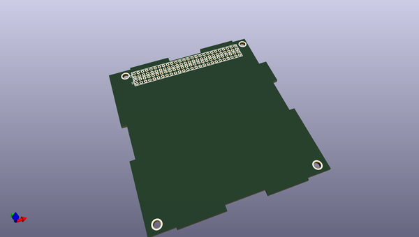

# OOMP Project  
## KiCad-Libraries  by imciner2  
  
(snippet of original readme)  
  
- KiCad Libraries  
  
A library containing Kicad schematic symbols, footprints, and project templates.  
  
- - -  
-- License  
  

 
  
  
This library is licensed under the Creative Commons BY-SA 4.0 license. The full legal text of the license may be found in the [License](LICENSE.txt) file in this repository. For more information about this license, please visit the Creative Commons Foundation (http://creativecommons.org/licenses/by-sa/4.0/).  
  
- - -  
-- Using this library  
  
There are 2 ways to use this library:   
  
1. Copy files locally into project directory (such as by making a Git Subtree)  
2. Make a reference to this git repository inside the project (such as by making a Git Submodule)  
  
Both of these methods are discussed in their respective files:  
  
1. [Git Subtrees](UsingGitSubtree.md)  
2. [Git Submodules](UsingGitSubmodule.md)  
  
--- 3D Parts  
  
In order to view the 3D parts that accompany the footprints, you must add an environment variable called KISYS3DMOD. If it has not been created, this variable points to the location of the preinstalled 3D models. To use these models and the ones in this repo, simply place both paths in the environment variable.  
  
Note: The path should be to the root of the repository, not the 3D directory.  
  
To add this in Linux (and remove existing m  
  full source readme at [readme_src.md](readme_src.md)  
  
source repo at: [https://github.com/imciner2/KiCad-Libraries](https://github.com/imciner2/KiCad-Libraries)  
## Board  
  
  
## Schematic  
  
  
  
[schematic pdf](working_schematic.pdf)  
## Images  
