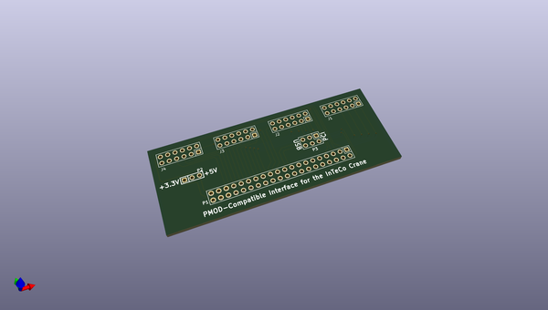
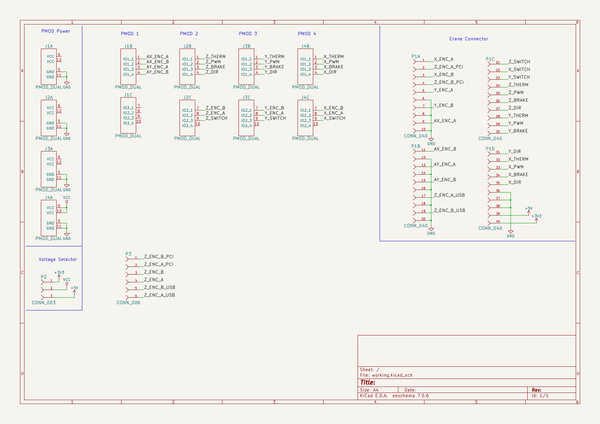

# OOMP Project  
## PMOD-Compatible_Interface_InTeCo-Crane  by imciner2  
  
(snippet of original readme)  
  
View this project on [CADLAB.io](https://cadlab.io/project/1718).   
  
- PMOD-Compatible_InTeCo-Interface  
PMOD Compatible interface for the 40-pin InTeCo digital connector  
  
  full source readme at [readme_src.md](readme_src.md)  
  
source repo at: [https://github.com/imciner2/PMOD-Compatible_Interface_InTeCo-Crane](https://github.com/imciner2/PMOD-Compatible_Interface_InTeCo-Crane)  
## Board  
  
  
## Schematic  
  
  
  
[schematic pdf](working_schematic.pdf)  
## Images  
