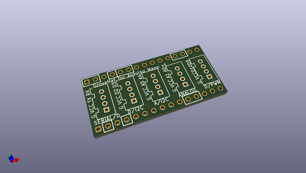
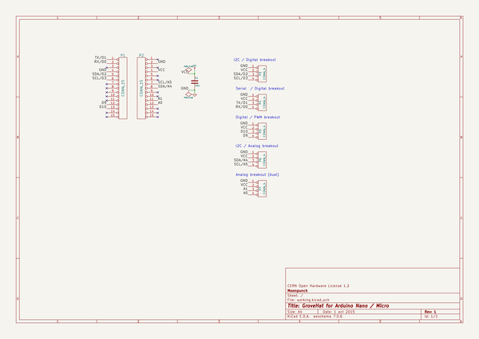

# OOMP Project  
## grovehat  by imrehg  
  
oomp key: oomp_projects_flat_imrehg_grovehat  
(snippet of original readme)  
  
- GroveHat for VIA VAB-820  
  
[Grove][grove] break-out board for [VIA VAB-820](vab820).  
  
Connectors:  
  
 * 2 x I2C  
 * 2 x Digital  
  
[grove]: http://www.seeedstudio.com/wiki/Grove_System "Grove System"  
[vab820]: http://www.viaembedded.com/en/boards/pico-itx/vab-820/ "VAB-820 product page"  
  
-- License  
  
CERN Open Hardware License 1.2, see `LICENSE.txt`.  
  
  full source readme at [readme_src.md](readme_src.md)  
  
source repo at: [https://github.com/imrehg/grovehat](https://github.com/imrehg/grovehat)  
## Board  
  
  
## Schematic  
  
  
  
[schematic pdf](working_schematic.pdf)  
## Images  
