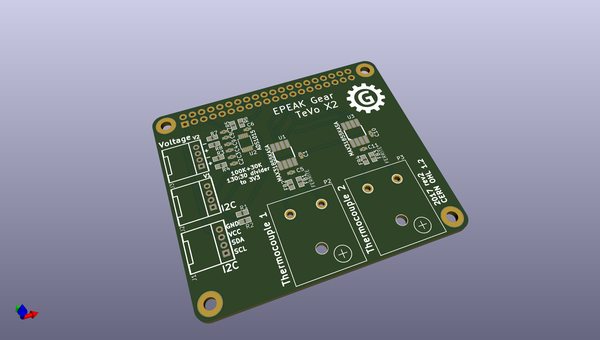
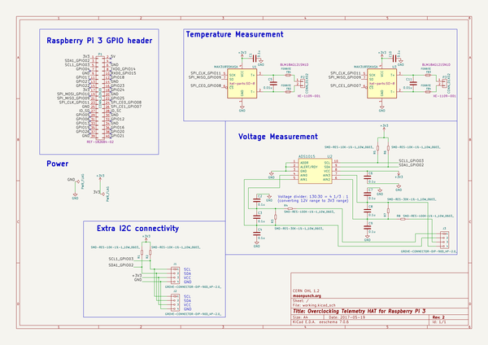

# OOMP Project  
## octelehat  by imrehg  
  
oomp key: oomp_projects_flat_imrehg_octelehat  
(snippet of original readme)  
  
- Overclocking Telemetry HAT  
  
A Raspberry Pi 3 HAT ("Hardware Attached on Top") specially designed for  
overclocking.  
  
* Temperature measurement  
* Voltage measurement  
* I2C connectors for expandability  
  
-- License  
  
Released under CERN Open Hardware License 1.2, available at  
http://www.ohwr.org/attachments/2388/cern_ohl_v_1_2.txt  
  
  full source readme at [readme_src.md](readme_src.md)  
  
source repo at: [https://github.com/imrehg/octelehat](https://github.com/imrehg/octelehat)  
## Board  
  
  
## Schematic  
  
  
  
[schematic pdf](working_schematic.pdf)  
## Images  
