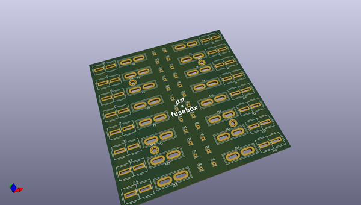
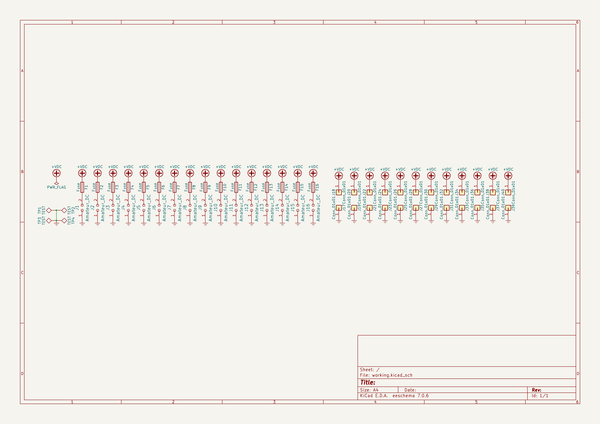

# OOMP Project  
## mupi-fusebox  by imuli  
  
oomp key: oomp_projects_flat_imuli_mupi_fusebox  
(snippet of original readme)  
  
- μπ fusebox  
  
This is a design for a 16-circuit fused power distribution board.  
Power input and output is via Anderson Powerpole connectors, using the ARES/RACES (and Anderson pre-bonded) standard housing arrangement.  
  
-- Copyright  
  
[This is free and unencumbered software released into the public domain.](https://unlicense.org)  
  
  
  full source readme at [readme_src.md](readme_src.md)  
  
source repo at: [https://github.com/imuli/mupi-fusebox](https://github.com/imuli/mupi-fusebox)  
## Board  
  
  
## Schematic  
  
  
  
[schematic pdf](working_schematic.pdf)  
## Images  
