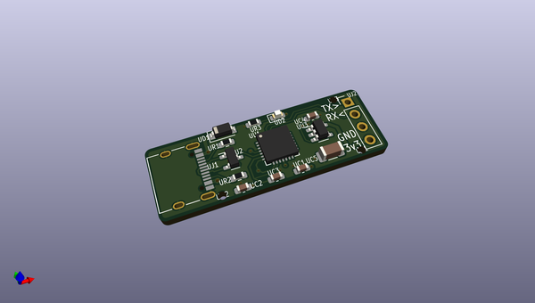
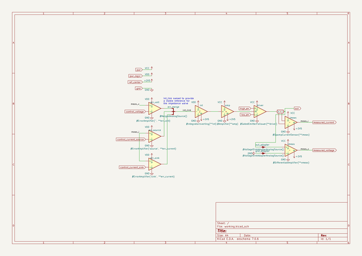

# OOMP Project  
## PolymorphicBlocks  by imuli  
  
(snippet of original readme)  
  
- Polymorphic Blocks  
  
Polymorphic Blocks is an open-source, Python-based [hardware description language (HDL)](https://en.wikipedia.org/wiki/Hardware_description_language) for [printed circuit boards (PCBs)](https://en.wikipedia.org/wiki/Printed_circuit_board).  
Unlike some existing PCB HDLs, our goal is not just "schematics in text" (or "Verilog for PCBs" 😨), but to increase design automation and accessibility by improving on the fundamental design model.  
Expressing designs and libraries in code not only allows basic automation like step-and-repeat with `for` loops, but also allows subcircuits to be reactive to their usage like automatically sizing power converters by output voltage and current draw.  
Adding programming language concepts, like type systems, interfaces, and inheritance, can also raise the level of design, while polymorphism allows libraries to be generic while retaining fine-grained control for system designers.  
  
Check out the [the getting started tutorial](getting-started.md) document for a more usage-focused introduction.  
Consider using the [IntelliJ plugin](https://github.com/BerkeleyHCI/edg-ide) that provides HDL compilation integration, side-by-side block diagram visualization, and graphical schematic-like HDL generation actions.   
A [reference document](reference.md) is also available, listing selected ports, links, and parts.  
  
For a slightly deeper technical overview, including summaries of example projects, check out our [UIST'20 paper and recorded talks  
  full source readme at [readme_src.md](readme_src.md)  
  
source repo at: [https://github.com/imuli/PolymorphicBlocks](https://github.com/imuli/PolymorphicBlocks)  
## Board  
  
  
## Schematic  
  
  
  
[schematic pdf](working_schematic.pdf)  
## Images  
