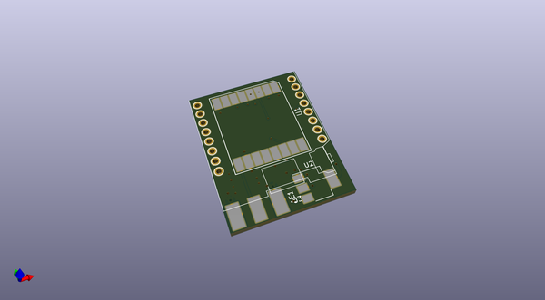
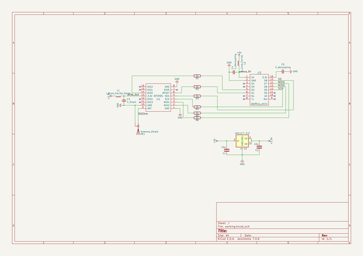

# OOMP Project  
## Lora-to-Wemos-D1-mini  by jerkey  
  
(snippet of original readme)  
  
- lora-to-nodemcu-circuit  
  
KiCad Circuit board for a Lora (RFM95) to the Wemo D1 Mini ESP8266 board connector for playing around with the two technologies. This board acts as a hat for the Wemo, and contains the lora chip, antenna and power circuits for powering the lora chip off of the 5v coming off of the Wemo's usb power.  
  
  
  
  full source readme at [readme_src.md](readme_src.md)  
  
source repo at: [https://github.com/jerkey/Lora-to-Wemos-D1-mini](https://github.com/jerkey/Lora-to-Wemos-D1-mini)  
## Board  
  
  
## Schematic  
  
  
  
[schematic pdf](working_schematic.pdf)  
## Images  
