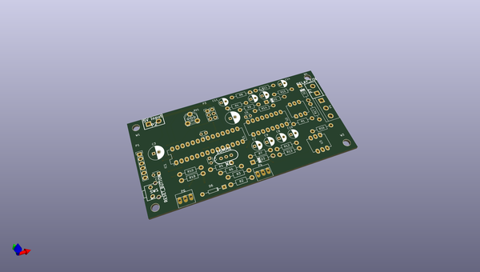
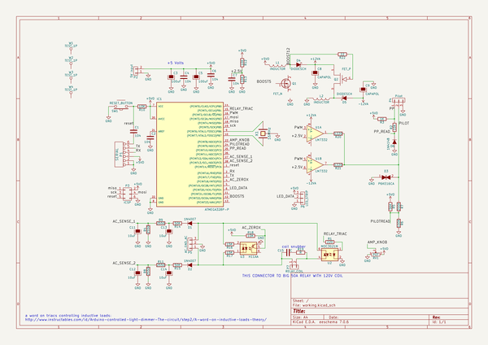

# OOMP Project  
## minievse  by jerkey  
  
oomp key: oomp_projects_flat_jerkey_minievse  
(snippet of original readme)  
  
- miniEVSE  
--Electric Vehicle Safety Equipment  
  
  
README.md for miniEVSE Hardware  
Files .pro .sch and .kicad_pcb in KiCAD format  
License CC BY-SA 3.0  
miniEVSE Hardware  
  
Inspired by OpenEVSE_PLUS project at https://github.com/OpenEVSE/OpenEVSE_PLUS/  
  
  full source readme at [readme_src.md](readme_src.md)  
  
source repo at: [https://github.com/jerkey/minievse](https://github.com/jerkey/minievse)  
## Board  
  
  
## Schematic  
  
  
  
[schematic pdf](working_schematic.pdf)  
## Images  
