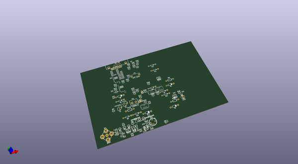
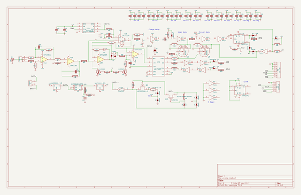

# OOMP Project  
## nukeanal  by jerkey  
  
oomp key: oomp_projects_flat_jerkey_nukeanal  
(snippet of original readme)  
  
-nukeanal  
--nuclear analyzer pulse capture board  
designed in KiCAD with Jerry Chamkis  
  
  
  
  
  full source readme at [readme_src.md](readme_src.md)  
  
source repo at: [https://github.com/jerkey/nukeanal](https://github.com/jerkey/nukeanal)  
## Board  
  
  
## Schematic  
  
  
  
[schematic pdf](working_schematic.pdf)  
## Images  
