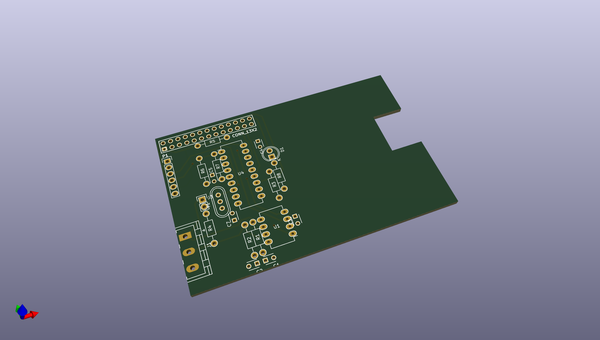

# OOMP Project  
## raspican  by jerkey  
  
(snippet of original readme)  
  
- raspican  
--raspberry pi CANbus hardware in kicad  
  
  
README.md for raspican Hardware  
Files .pro .sch and .kicad_pcb in KiCAD format  
License CC BY-SA 3.0  
raspican Hardware  
  
how to setup cansend software on the raspberry pi:  
-------------------------------------------------  
http://skpang.co.uk/blog/archives/1165  
  
_Inspired by retired PICAN project at:_  
  
http://skpang.co.uk/catalog/pican-canbus-board-retired-replacement-available-p-1196.html  
  
````  
22:54 < jerkey_> http://www.cowfishstudios.com/blog/canned-pi-part1  
23:25 <@amatus> this stuff is out of date  
23:25 <@amatus> this is what i did:  
23:26 <@amatus> sudo apt-get install can-utils  
23:26 <@amatus> echo dtoverlay=mcp2515-can0,oscillator=16000000,interrupt=25 >> /boot/config.txt  
23:27 <@amatus> reboot  
23:36 <@amatus> scratch that, echo dtoverlay=mcp2515-can0 >> /boot/config.txt  
23:40 < jerkey_> https://github.com/jerkey/raspican  
23:50 <@amatus> then follow the ip ... commands  
Day changed to 14 Mar 2017  
00:56 < jerkey_> i bet your car wasn't spitting rhymes where it was supposed to.  i can't find anything wrong with this hardware!  
````  
  
  full source readme at [readme_src.md](readme_src.md)  
  
source repo at: [https://github.com/jerkey/raspican](https://github.com/jerkey/raspican)  
## Board  
  
[](working_3d.png)  
## Schematic  
  
[](working_schematic.png)  
  
[schematic pdf](working_schematic.pdf)  
## Images  
