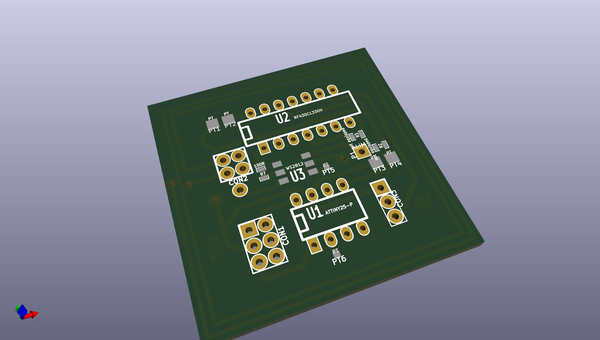
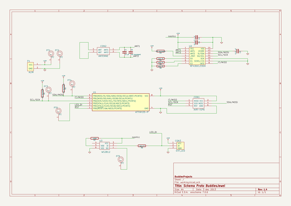

# OOMP Project  
## buddiesjewel_firmware  by jerome-labidurie  
  
(snippet of original readme)  
  
buddiesjewel_firmware  
=====================  
  
Firmware (arduino, attiny45) for BuddiesJewel project  
  
http://fablab-lannion.org/wiki/index.php?title=BuddiesJewel  
  
* attiny45/ : firmware attiny45 et RF430CL330H  
* BlinkM/ : archive de BlinkM et outils de flashage  
* hardware/ : schémas  
* serial2rgb/ : commande d'une led rgb par liason série (via arduino)  
* tag2rgb/ : lecture couleur dans un tag et commande rgb (shield nfc reader)  
* TI_dynamic_tag/ : utilisation par un arduino du RF430Cl330H  
  
  full source readme at [readme_src.md](readme_src.md)  
  
source repo at: [https://github.com/jerome-labidurie/buddiesjewel_firmware](https://github.com/jerome-labidurie/buddiesjewel_firmware)  
## Board  
  
  
## Schematic  
  
  
  
[schematic pdf](working_schematic.pdf)  
## Images  
