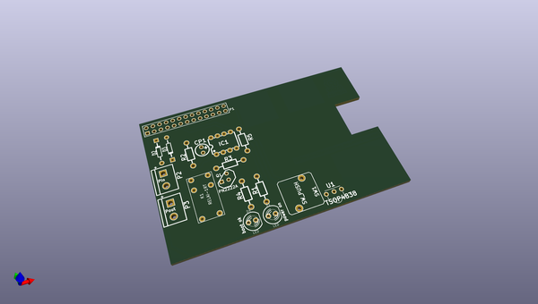
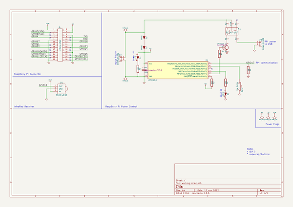

# OOMP Project  
## RPiSU  by jerome-labidurie  
  
oomp key: oomp_projects_flat_jerome_labidurie_rpisu  
(snippet of original readme)  
  
INSTALL:  
  
* Make your own PCB  
* Burn firmware  
* Connect wires (take a look in PCB files)  
* Press On/Off button to start Raspberry Pi  
* Copy RPiSU.sh to users home dir  
* Execute 'sudo chmod 766 /home/users home dir/RPiSU.sh'  
* Add command '/home/user/RPiSU.sh &' above 'exit 0' in /etc/rc.local  
* Reboot  
  
  full source readme at [readme_src.md](readme_src.md)  
  
source repo at: [https://github.com/jerome-labidurie/RPiSU](https://github.com/jerome-labidurie/RPiSU)  
## Board  
  
  
## Schematic  
  
  
  
[schematic pdf](working_schematic.pdf)  
## Images  
