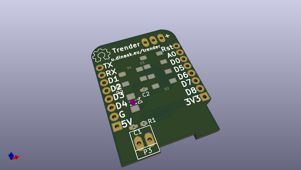
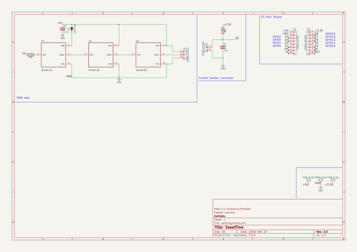

# OOMP Project  
## Trender  by jerome-labidurie  
  
(snippet of original readme)  
  
- Trender  
- Main SW used for Trender Project. See here for details : http://wiki.fablab-lannion.org/index.php?title=Trender  
  full source readme at [readme_src.md](readme_src.md)  
  
source repo at: [https://github.com/jerome-labidurie/Trender](https://github.com/jerome-labidurie/Trender)  
## Board  
  
  
## Schematic  
  
  
  
[schematic pdf](working_schematic.pdf)  
## Images  
