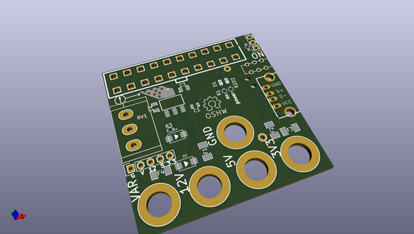
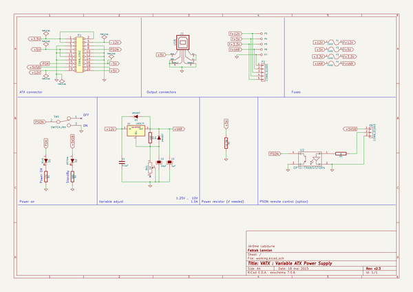

# OOMP Project  
## vatx  by jerome-labidurie  
  
(snippet of original readme)  
  
Simple breakoutboard to use an ATX PSU as variable PSU  
======================================================  
  
* Goal is to use a un-modified ATX PSU.  
* mostly one side-PCB for very simple creation  
* Use banana plugs for every voltage  
* Use LM317 for 1.5A variable voltage (~ 3-11V)  
* USB connector for particular devices  
* StandBy/Power leds  
* OpenHardware CC:BY-SA http://creativecommons.org/licenses/by-sa/3.0/  
  
  full source readme at [readme_src.md](readme_src.md)  
  
source repo at: [https://github.com/jerome-labidurie/vatx](https://github.com/jerome-labidurie/vatx)  
## Board  
  
  
## Schematic  
  
  
  
[schematic pdf](working_schematic.pdf)  
## Images  
