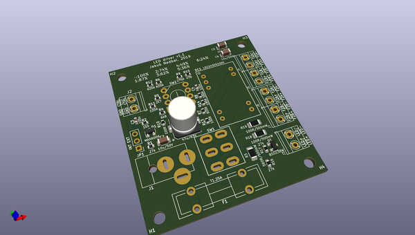
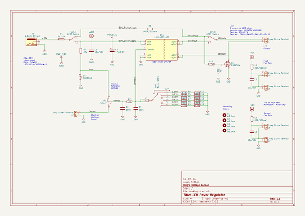

# OOMP Project  
## LEDregulator  by jnedbal  
  
(snippet of original readme)  
  
- LEDregulator  
LED regulator electronics circuit for the [illuminated orbital shaker for microalgae cultures](https://app.labstep.com/sharelink/221d4460-8591-4ab5-ac0c-70b54c93532a).  
  
The circuit serves two functions: It regulates the current to the LED illuminator and it controls fans cooling the LEDs.  
  
There are two modes of operation supported by the circuit: The trickle current mode and the variable current mode.  
  
The trickle current mode allows low current to flow throught the LEDs. This provides sufficient light to sustain the culture for long periods of time at a slow growth rate.  
  
The variable current mode allows the user to choose from seven current settings using a rotary switch to vary the illumination light power delivered to the culture. In this mode, the cooling fans are switched on to keep the temperature of the culture close to the ambient temperature and avoid its overheating.  
  
  full source readme at [readme_src.md](readme_src.md)  
  
source repo at: [https://github.com/jnedbal/LEDregulator](https://github.com/jnedbal/LEDregulator)  
## Board  
  
  
## Schematic  
  
  
  
[schematic pdf](working_schematic.pdf)  
## Images  
