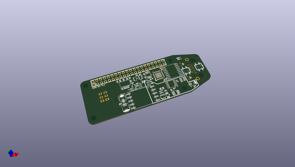

# OOMP Project  
## PoEPi-hardware  by JoanTheSpark  
  
oomp key: oomp_projects_flat_joanthespark_poepi_hardware  
(snippet of original readme)  
  
-- Raspberry Pi Zero - PoEPi  
  
The Raspberry Pi Zero is a low power and low footprint Raspberry Pi. It gives people an opportunity to move towards compact connected devices  
while moving away from being a just a small computer. PiPoE adds a new way of connecting the Raspberry Pi Zero with the world in a very efficient  
manner. Power over Ethernet is a way if injecting power into an Ethernet cable without interfering with the data. What it gives you is a high   
reliability way of powering and communicating with the Raspberry Pi. The design of PoEPi is open source under the CERN OHL V1.2 and can be easily  
adapted to your own custom designs.   
  
For more information check out the Wiki on github  
  
--- Basic Hardware usage  
  
1. Setup your Raspberry Pi with a monitor and enable SSH with raspi-config  
2. Plug Ethernet cable into a PoE switch or add a PoE injector somehwhere in you Ethernet line  
3. Connect the PoEPi to the Raspberry Pi  
4. Plug in the "injected" Ethernet cable  
5. The Pi Zero should be powered and you then SSH into the Pi  
  
For information on the particular PoEPi modules and how to control them please see the wiki on the github page   
  
  full source readme at [readme_src.md](readme_src.md)  
  
source repo at: [https://github.com/JoanTheSpark/PoEPi-hardware](https://github.com/JoanTheSpark/PoEPi-hardware)  
## Board  
  
  
## Schematic  
  
  
  
[schematic pdf](working_schematic.pdf)  
## Images  
