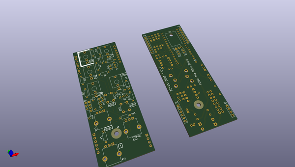
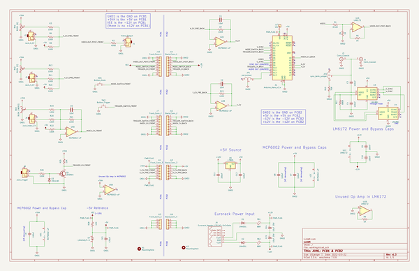

# OOMP Project  
## avml-hardware  by joem  
  
(snippet of original readme)  
  
AVML Hardware  
=============  
  
*KiCad projects for the AVML hardware*  
  
This repo is the sister repo to avml-software (link TBD).  
<!-- FIXME: add this link to the repo! -->  
  
About the AVML  
--------------  
  
AVML stands for *Arduino Video Module L*, though I never really refer to it by that long name. It's a eurorack format module that uses an Arduino Nano to generate video in the [LZX patchable video format](https://lzxindustries.net). I originally made the module to be a text generator and pattern generator, but it includes several different modes by default and can be programmed to do whatever you want (within its abilities). The microcontroller at the heart of the Arduino Nano is not the most capable microcontroller, but there are a lot of Arduino programming resources out there for it. Further, since I'm using a stock (unmodified) Nano, its video capabilities are reduced to very low-res black and white, but it's a fun aesthetic to work with.  
  
Note: While the AVML can certainly be modded to not require sync and to output composite video, it can not do those things without modification. Eventually I hope to release either mod details or a separate device/module for that, but I have not done so yet. Sorry.  
  
Usage  
-----  
  
*to be added*  
<!-- FIXME: add this info! -->  
<!-- maybe link to another page somewhere? or have a usage file? -->  
  
About the schematic  
-------------------  
  
An easily readable PDF schematic for the module is in the `pcb/pdfs/` folder.  
  
  
About the PCBs/panel  
-------  
  full source readme at [readme_src.md](readme_src.md)  
  
source repo at: [https://github.com/joem/avml-hardware](https://github.com/joem/avml-hardware)  
## Board  
  
  
## Schematic  
  
  
  
[schematic pdf](working_schematic.pdf)  
## Images  
