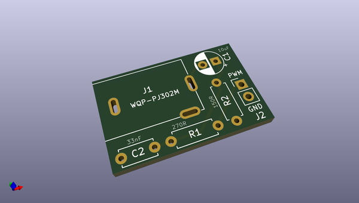
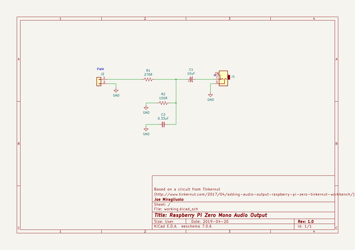

# OOMP Project  
## raspberry_pi_zero_mono_audio_out  by joem  
  
oomp key: oomp_projects_flat_joem_raspberry_pi_zero_mono_audio_out  
(snippet of original readme)  
  
  
  full source readme at [readme_src.md](readme_src.md)  
  
source repo at: [https://github.com/joem/raspberry_pi_zero_mono_audio_out](https://github.com/joem/raspberry_pi_zero_mono_audio_out)  
## Board  
  
  
## Schematic  
  
  
  
[schematic pdf](working_schematic.pdf)  
## Images  
