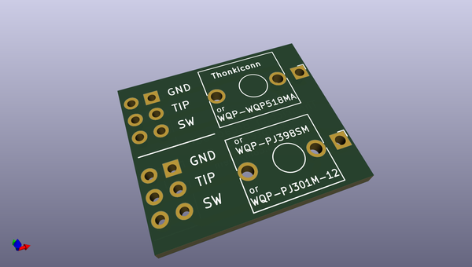
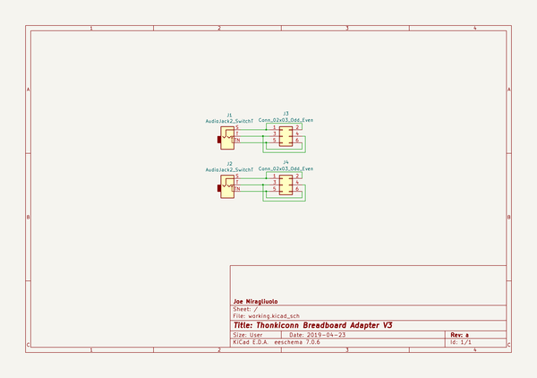

# OOMP Project  
## thonkiconn_breadboard_adapter_v3  by joem  
  
oomp key: oomp_projects_flat_joem_thonkiconn_breadboard_adapter_v3  
(snippet of original readme)  
  
  
  full source readme at [readme_src.md](readme_src.md)  
  
source repo at: [https://github.com/joem/thonkiconn_breadboard_adapter_v3](https://github.com/joem/thonkiconn_breadboard_adapter_v3)  
## Board  
  
  
## Schematic  
  
  
  
[schematic pdf](working_schematic.pdf)  
## Images  
