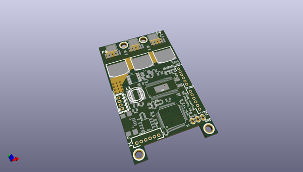

# OOMP Project  
## bldc  by johaa1993  
  
(snippet of original readme)  
  
bldc-hardware  
=============  
  
This the Hardware for my open source custom ESC. This is a forked repository from mrkindustries, who made many improvements to my original hardware design.  
  
Here is a BOM on google drive that I try to keep up to date:  
https://docs.google.com/spreadsheet/ccc?key=0AnvZ-ouEB058dGpzaDl4MUxNM3NxZ1BzTWNZZ1RhRUE&usp=sharing  
  
Have a look at this post for a tutorial on how to get started:  
http://vedder.se/2014/01/a-custom-bldc-motor-controller/  
  
  full source readme at [readme_src.md](readme_src.md)  
  
source repo at: [https://github.com/johaa1993/bldc](https://github.com/johaa1993/bldc)  
## Board  
  
  
## Schematic  
  
  
  
[schematic pdf](working_schematic.pdf)  
## Images  
