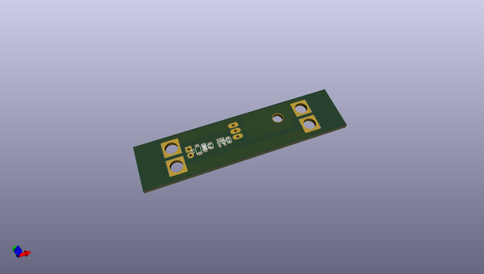
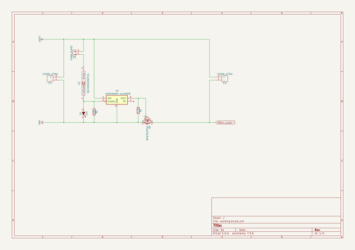

# OOMP Project  
## PDB  by johaa1993  
  
(snippet of original readme)  
  
- PDB  
  
  
- Kill switch  
The goal is to switch high power with low power (TTL logic level).  
If somethings goes wrong then the user might want to kill the system until further damages happens.  
  
Mechanical relay or MOSFET can be used for such application.  
  
-- MOSFET driver  
The MOSFET can be damaged if driven incorectly.  
  
--- Drain-source resistance `R_ds`  
Applying gate-source voltage will decrease drain-source resistance over time. If the drain-source resistance decreases too slow while drain-source current is conducted then the MOSFET will heat up and possably get damaged. The time it takes to reach fully turned on MOSFET depends on gate capacitance, gate resistance and the MOSFET gate driver ability to deliver current.  
  
--- Gate-source voltage `V_GS`  
Applying too high gate-source voltage will damage the MOSFET.  
  
  
--- Parasitic oscillation  
The MOSFET internal capacitance and the wires inductance combined will inevitably create a RLC curcuit.  
A step response on the `V_GS` will have a oscilation. Higher gate resistance => higher damping, higher switch time. Lower gate resistance => lower damping, lower switch time.  
It's up to the user to find a fine balance between the switch time and parasitic oscillation.  
  
--- [LM5050](http://www.ti.com/lit/ds/symlink/lm5050-1-q1.pdf)  
MOSFET gate driver.   
  
  
  
http://toshiba.semicon-storage.com/us/design-support/document/application-note.html  
Application Precautions: Power MOSFET Application Notes  
  
--- More  
Taking all these into consideration when   
  full source readme at [readme_src.md](readme_src.md)  
  
source repo at: [https://github.com/johaa1993/PDB](https://github.com/johaa1993/PDB)  
## Board  
  
  
## Schematic  
  
  
  
[schematic pdf](working_schematic.pdf)  
## Images  
