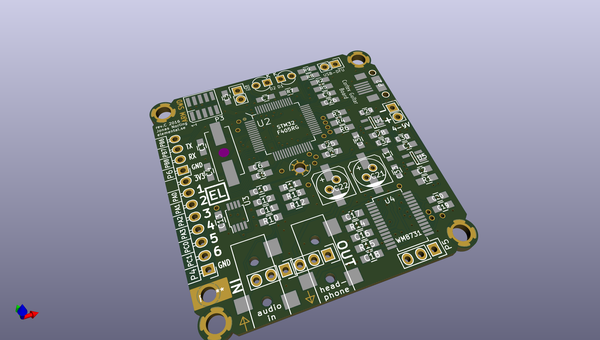

# OOMP Project  
## guitarboard  by JonasNorling  
  
(snippet of original readme)  
  
The Cortex Guitar Board  
=======================  
  
This is a Cortex-M4 DSP board for development of audio DSP  
applications such as Guitar effects.  
  
This repository contains the hardware design as KiCAD files and sample  
software that implements some naive guitar effects. For info about the  
software and how to load it, look at [fw/README.md](fw/README.md). For  
more on the hardware, keep on reading below and also look in  
[hw/README.md](hw/README.md).  
  
The board is based on a STM32F405RG microcontroller (192KiB RAM,  
Cortex-M4 with DSP and floating point instructions) and a WM8731 audio  
codec.  
  
  
  
  
  
About the hardware  
------------------  
  
--- Audio chain  
  
The stereo audio input is pre-amplified in an opamp before the signal  
reaches the ADC. This step is required to get a high input impedance  
suitable for connecting to an electric guitar or other passive  
systems. A WM8731 audio codec is used to digitize the audio signal and  
feed it over an I2S bus to the STM32 MCU, and to convert the resulting  
signal back into the analog domain. The codec chip includes an  
amplifier so the board is capable of driving low-impedance loads such  
as headphones.  
  
Note that this isn't quite a HiFi system, though it should be good  
enough for casual use. For example, there is some theoretical  
crosstalk between the L/R channe  
  full source readme at [readme_src.md](readme_src.md)  
  
source repo at: [https://github.com/JonasNorling/guitarboard](https://github.com/JonasNorling/guitarboard)  
## Board  
  
  
## Schematic  
  
  
  
[schematic pdf](working_schematic.pdf)  
## Images  
