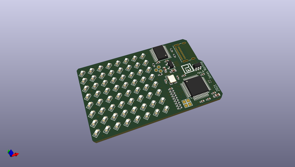
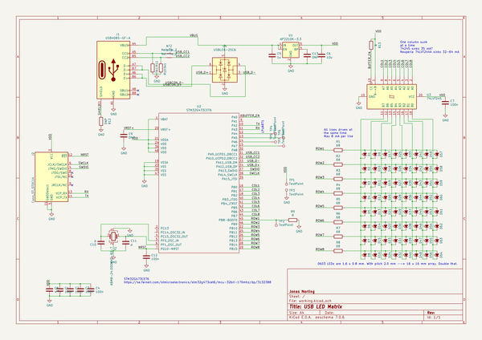

# OOMP Project  
## usb-led-matrix  by JonasNorling  
  
oomp key: oomp_projects_flat_jonasnorling_usb_led_matrix  
(snippet of original readme)  
  
A USB connected LED matrix  
==========================  
  
This is a quick holidays project from 2020/2021. It is a 8×8 SMD LED matrix board with a STM32G4 and USB-C connector.  
  
What it does is up to the software but currently I use it to display CPU load on my PC. When not connected to a USB host it displays a calm animation.  
  
  
  
  full source readme at [readme_src.md](readme_src.md)  
  
source repo at: [https://github.com/JonasNorling/usb-led-matrix](https://github.com/JonasNorling/usb-led-matrix)  
## Board  
  
  
## Schematic  
  
  
  
[schematic pdf](working_schematic.pdf)  
## Images  
