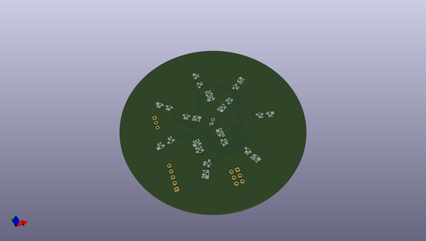

# OOMP Project  
## coaster  by jp3cyc  
  
oomp key: oomp_projects_flat_jp3cyc_coaster  
(snippet of original readme)  
  
- coaster  
光る！コースタです。いざって時(e.g. 友達が遊びに来た、地震、台風の時とか)にはArduinoとしても活躍します。  
  
- 用意するもの  
-- 部品  
- チップLED 1608サイズ 12個  
- チップ抵抗 270Ω 1608サイズ 12個  
- チップ抵抗 10kΩ 1608サイズ 1個  
- ATMEGA328P-AU 1個  
- 基板実装型スイッチ 1個  
- CR2032表面実装型ケース 1個  
- CR2032 1個  
  
-- 道具  
- AVR書き込み機　または Arduino UNO  
- はんだごて  
- はんだ  
- リフロー炉（あれば楽）  
- クリームはんだ（あれば楽）  
- ピンセット（あれば便利）  
- 顕微鏡（あれば便利）  
- レーザ加工機（自宅にあると◎、ない場合はファボラボ or カインズに行く、カッターで頑張るのもあり）  
  
- How to makke  
1. プリント基板を注文する。Fusion PCB、PCBgogo、Elecrowとか。10枚$10＋送料です。coaster/circuit/garb/coaster-garbdata.zipを送るだけ  
1. プリント基板が届くまでに部品を注文する。http://aki.prioris.jp/list/31d5aa3b-d171-41f0-a121-0a985a356ac1/ ワンクリックですべての部品があきづきカートに入ります。一個分の部品です。  
1. コースタ基板を入れるためのケースを作ります。coaster-cutting.aiに入っているデータを誤自宅のレーザカッタで切断します。データはIllustrator形式ですが、みるだけならCoral Drawとかでもいけます。  
1. はんだづけします。  
1. AVRのFuseビットを変更します。lfuse:0xe2, hfuse:0xde, efuse:0x07（書き込めない場合はY1に8MHzの水晶、C1,C2に22pFのコンデンサをつけてみる）(firwareフォルダにコマンドが入っています）  
1. プログラムを書き込みます。coaster-firmware/coaster-firmware.ino.with_bootloader.eightanaloginputs.hexを書き込みます。  
1. ボタン電池を入れて、スイッチを入れるとつくはずです。つかなければ、電池残量、スイッチ、はんだ付けを見てみます。  
  
  
  full source readme at [readme_src.md](readme_src.md)  
  
source repo at: [https://github.com/jp3cyc/coaster](https://github.com/jp3cyc/coaster)  
## Board  
  
  
## Schematic  
  
  
  
[schematic pdf](working_schematic.pdf)  
## Images  
