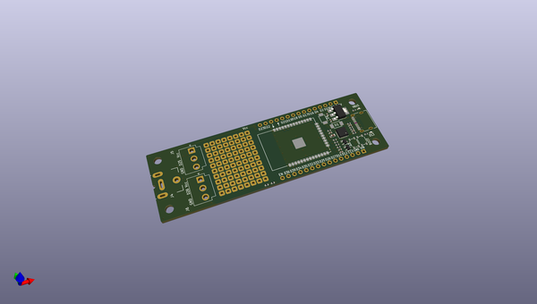
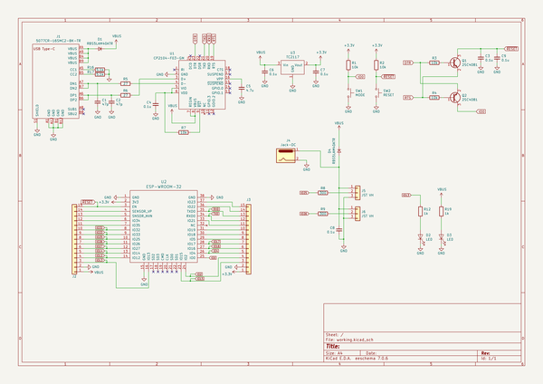

# OOMP Project  
## ESP32dev_servo  by jp3cyc  
  
oomp key: oomp_projects_flat_jp3cyc_esp32dev_servo  
(snippet of original readme)  
  
- ESP32dev_servo  
ESP32のDevボードにNeopixcelをつなげるための端子とACアダプタ端子を付けた基板。  
  
- 特徴  
- USB端子にType-Cを採用  
- あとから拡張性の高いユニバーサル基板を確保  
- RESETラインに追加のCを取り付けるスペースを用意済み（CP2104はPCによっては追加のCをつけないと自動書き込みができない）  
  
  full source readme at [readme_src.md](readme_src.md)  
  
source repo at: [https://github.com/jp3cyc/ESP32dev_servo](https://github.com/jp3cyc/ESP32dev_servo)  
## Board  
  
  
## Schematic  
  
  
  
[schematic pdf](working_schematic.pdf)  
## Images  
