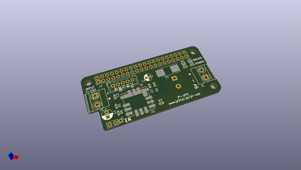
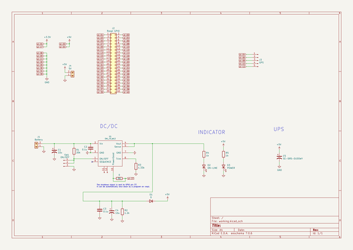

# OOMP Project  
## Pi-UPS  by jp3cyc  
  
oomp key: oomp_projects_flat_jp3cyc_pi_ups  
(snippet of original readme)  
  
- Pi-UPS  
ラズパイのUPSです．瞬低によるラズパイの再起動を防ぎます．保護時間は1秒もないです．  
  
- 機能  
- UPS機能  
- LiPo電源（最高入力電圧14V)から5V作る  
- 5V出力端子つき  
- 電圧は固定（R3の調整により出力電圧は調整可）  
  
  full source readme at [readme_src.md](readme_src.md)  
  
source repo at: [https://github.com/jp3cyc/Pi-UPS](https://github.com/jp3cyc/Pi-UPS)  
## Board  
  
  
## Schematic  
  
  
  
[schematic pdf](working_schematic.pdf)  
## Images  
