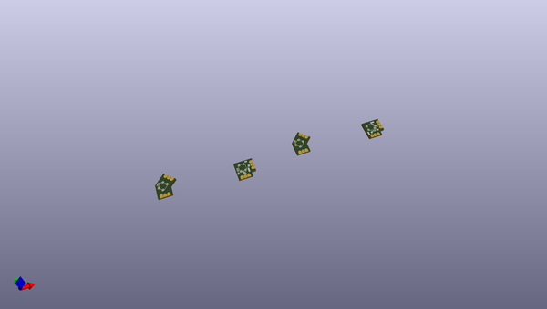

# OOMP Project  
## WS2812B-Corners  by Junes-PhD  
  
(snippet of original readme)  
  
- WS2812B Corners  
  
  
  full source readme at [readme_src.md](readme_src.md)  
  
source repo at: [https://github.com/Junes-PhD/WS2812B-Corners](https://github.com/Junes-PhD/WS2812B-Corners)  
## Board  
  
  
## Schematic  
  
  
  
[schematic pdf](working_schematic.pdf)  
## Images  
