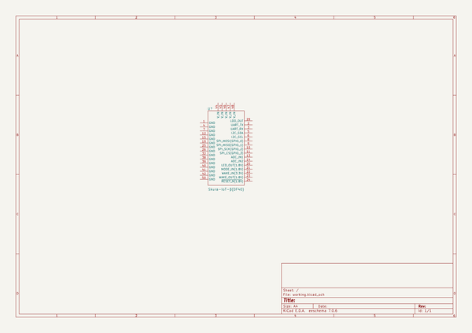

# OOMP Project  
## SakuraIoT-Kicad-Module  by Kazu-zamasu  
  
oomp key: oomp_projects_flat_kazu_zamasu_sakuraiot_kicad_module  
(snippet of original readme)  
  
  
  full source readme at [readme_src.md](readme_src.md)  
  
source repo at: [https://github.com/Kazu-zamasu/SakuraIoT-Kicad-Module](https://github.com/Kazu-zamasu/SakuraIoT-Kicad-Module)  
## Board  
  
  
## Schematic  
  
  
  
[schematic pdf](working_schematic.pdf)  
## Images  
