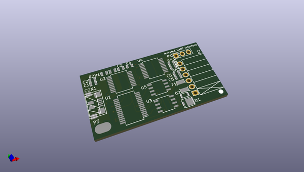
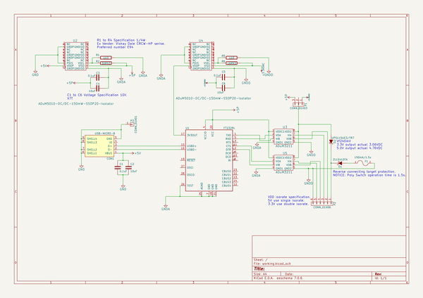

# OOMP Project  
## USB-UART  by Kazu-zamasu  
  
oomp key: oomp_projects_flat_kazu_zamasu_usb_uart  
(snippet of original readme)  
  
- USB-UART  
Build on KiCAD EDA  
作ってみましたが、無保証で。  
いかに現在販売されてるのが良い出来で安いのか判る為に作った。  
このタイプは二重絶縁。普通は必要ないです。一重絶縁で十分。売ってるもの買ったほうが安いです。  
  
  full source readme at [readme_src.md](readme_src.md)  
  
source repo at: [https://github.com/Kazu-zamasu/USB-UART](https://github.com/Kazu-zamasu/USB-UART)  
## Board  
  
  
## Schematic  
  
  
  
[schematic pdf](working_schematic.pdf)  
## Images  
