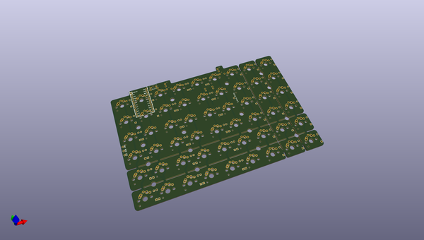
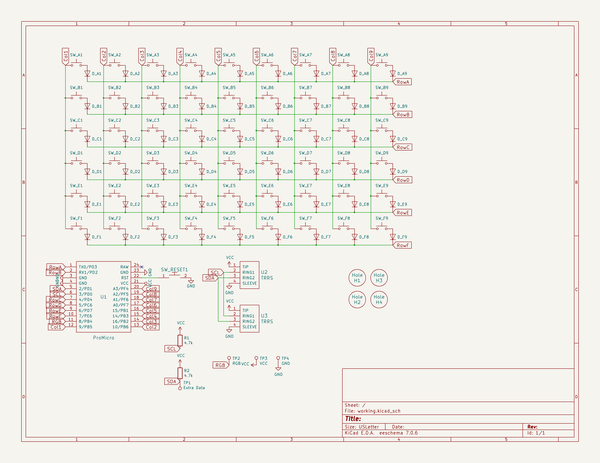

# OOMP Project  
## bfo9000-pcb  by keebio  
  
oomp key: oomp_projects_flat_keebio_bfo9000_pcb  
(snippet of original readme)  
  
- BFO-9000 PCB  
  
  
  
These files are provided as-is, and I won't be providing any updates to them.  
  
If anyone wants to clean things up or make fixes, go ahead and submit a PR. Thanks!  
  
The plate files can be found here: https://github.com/keebio/bfo-9000-case  
  
-- License  
  
These files are released under the MIT License.  
  
  full source readme at [readme_src.md](readme_src.md)  
  
source repo at: [https://github.com/keebio/bfo9000-pcb](https://github.com/keebio/bfo9000-pcb)  
## Board  
  
  
## Schematic  
  
  
  
[schematic pdf](working_schematic.pdf)  
## Images  
