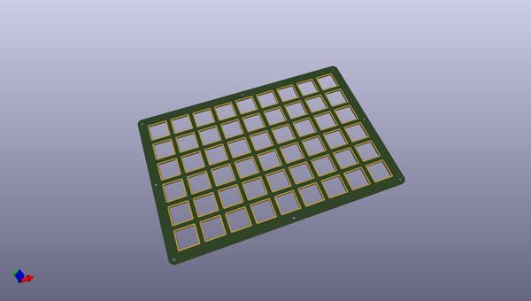

# OOMP Project  
## bfo-9000-case  by keebio  
  
(snippet of original readme)  
  
- BFO-9000 Plate Files  
  
These files are for the FR4 plates for the BFO-9000 in 6x9 layout.  
  
-- License  
  
These case files are released under the MIT License.  
  
  full source readme at [readme_src.md](readme_src.md)  
  
source repo at: [https://github.com/keebio/bfo-9000-case](https://github.com/keebio/bfo-9000-case)  
## Board  
  
  
## Schematic  
  
  
  
[schematic pdf](working_schematic.pdf)  
## Images  
