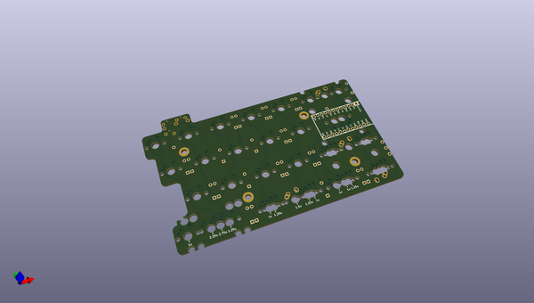
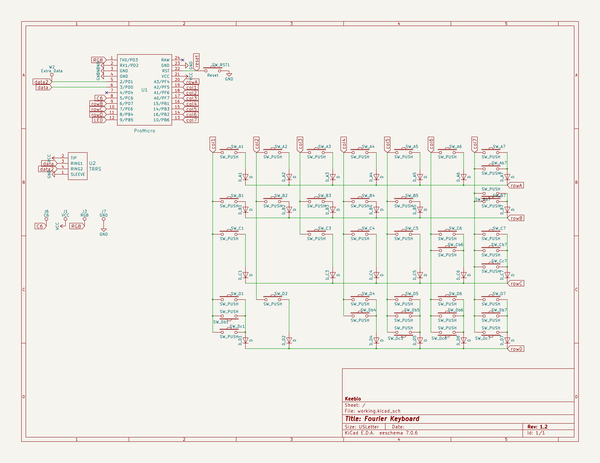

# OOMP Project  
## fourier  by keebio  
  
oomp key: oomp_projects_flat_keebio_fourier  
(snippet of original readme)  
  
Fourier Keyboard PCB  
====================  
  
  
  
Misc Info  
---------  
- Rev. 1.2 added 1.25u/1u option at the inner two keys of each half, QMK support hasn't been added for those two new keys yet  
- Keyboard Layout Editor: [Fourier 1.2 layout](http://www.keyboard-layout-editor.com/-/gists/ec52e429382754843fa2ddb02aecfc4a)  
  
License  
-------  
These files are released under the MIT License.  
  
  full source readme at [readme_src.md](readme_src.md)  
  
source repo at: [https://github.com/keebio/fourier](https://github.com/keebio/fourier)  
## Board  
  
  
## Schematic  
  
  
  
[schematic pdf](working_schematic.pdf)  
## Images  
