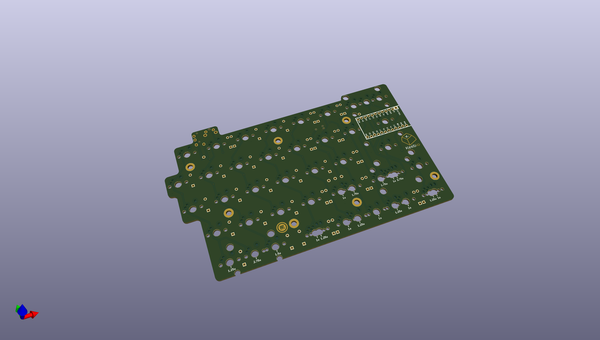
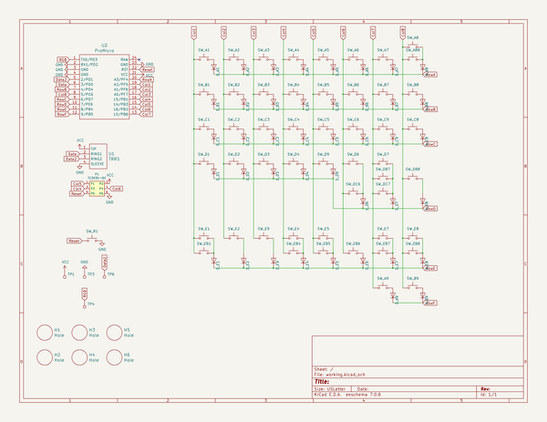

# OOMP Project  
## quefrency-rev1-pcb  by keebio  
  
(snippet of original readme)  
  
Quefrency Rev. 1 Keyboard PCB  
=============================  
  
Files are provided as-is, as I haven't fully had the chance to clean everything up. The working name of the Quefrency was Spectrogram, hence some of the files being marked with that name.  
  
If anyone wants to clean things up, go ahead and submit a PR. Thanks!  
  
License  
-------  
These files are released under the MIT License.  
  
  full source readme at [readme_src.md](readme_src.md)  
  
source repo at: [https://github.com/keebio/quefrency-rev1-pcb](https://github.com/keebio/quefrency-rev1-pcb)  
## Board  
  
  
## Schematic  
  
  
  
[schematic pdf](working_schematic.pdf)  
## Images  
